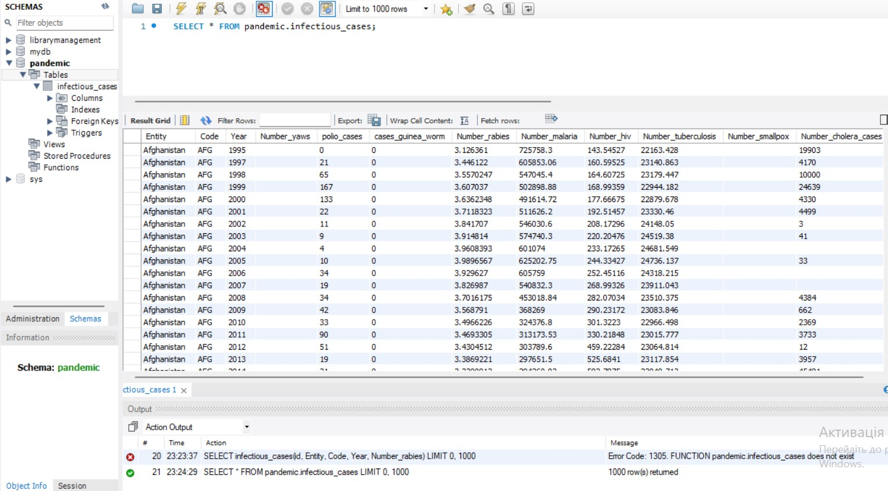
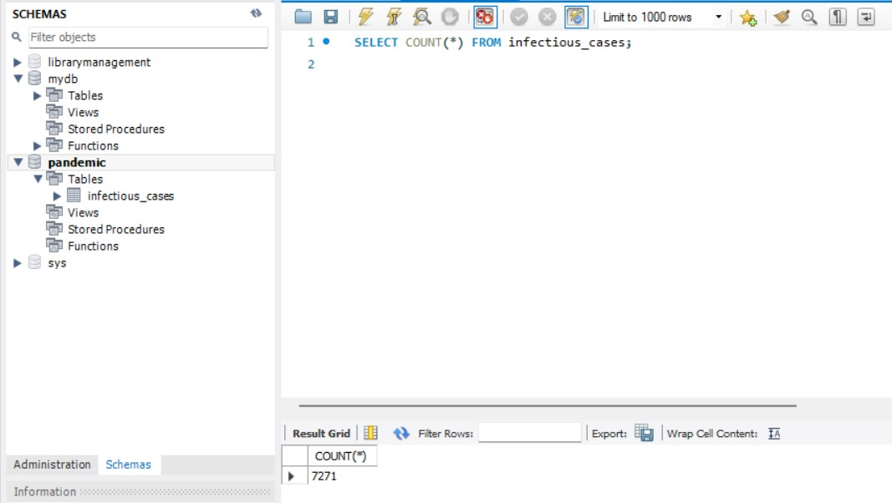
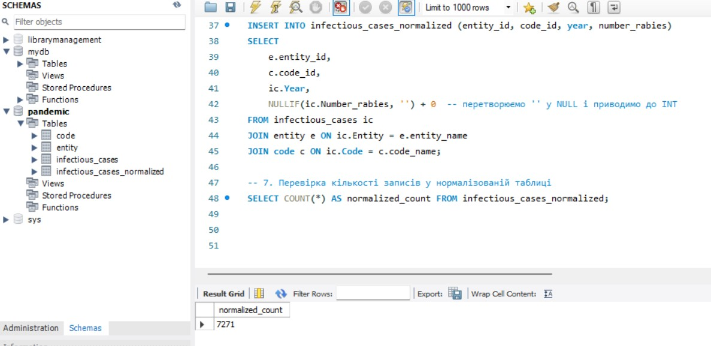
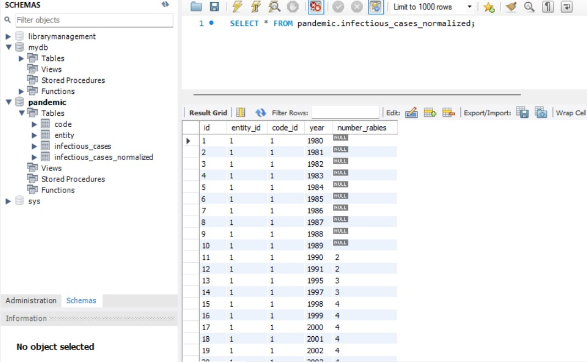
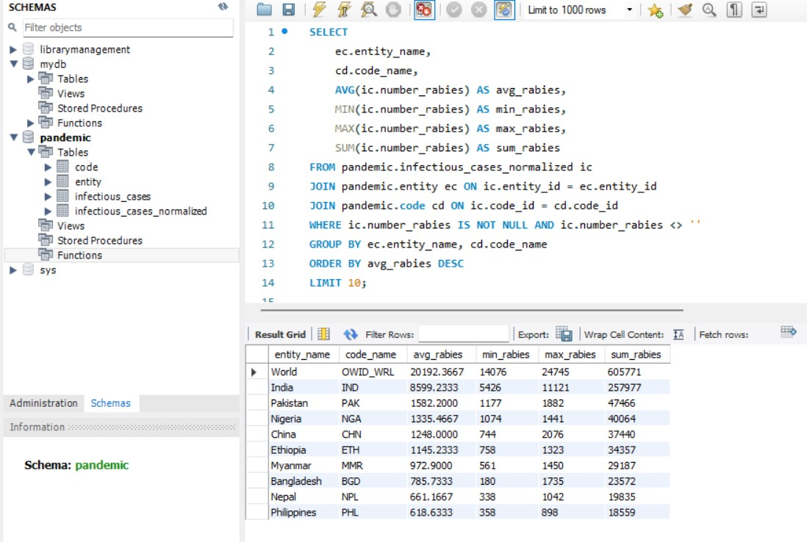
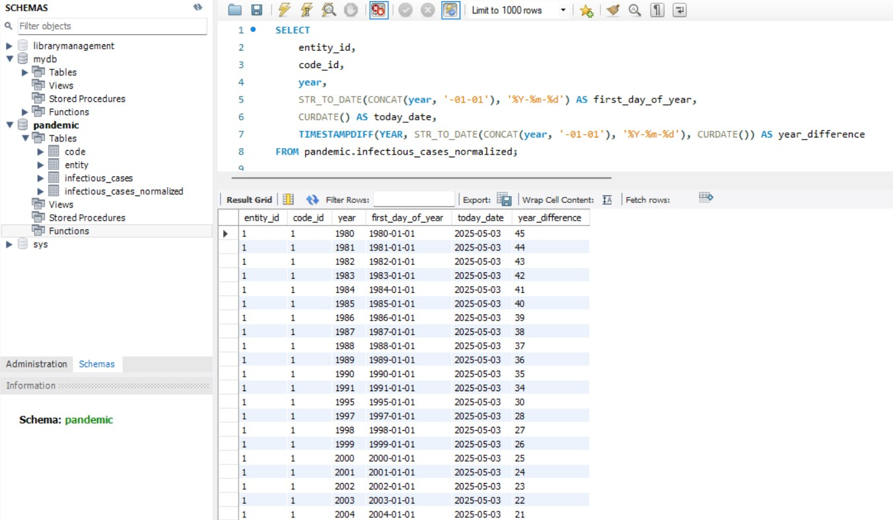
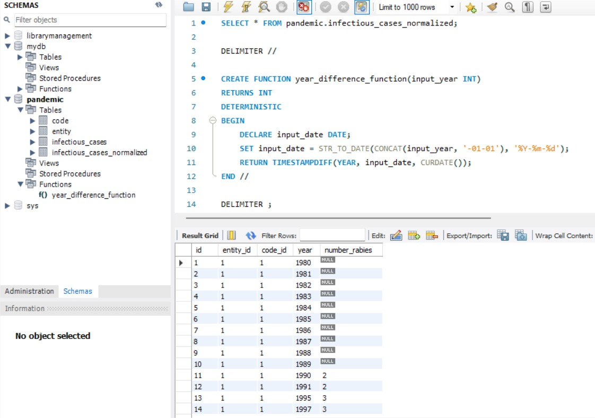
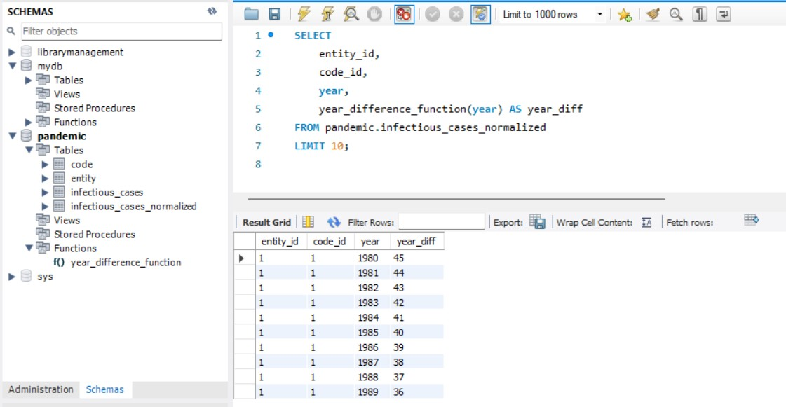
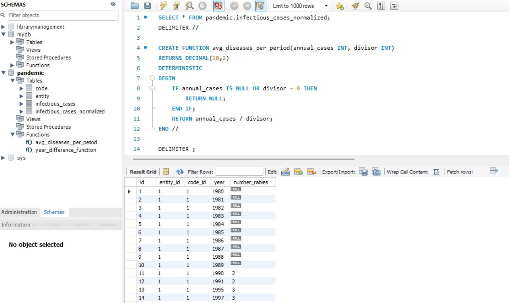
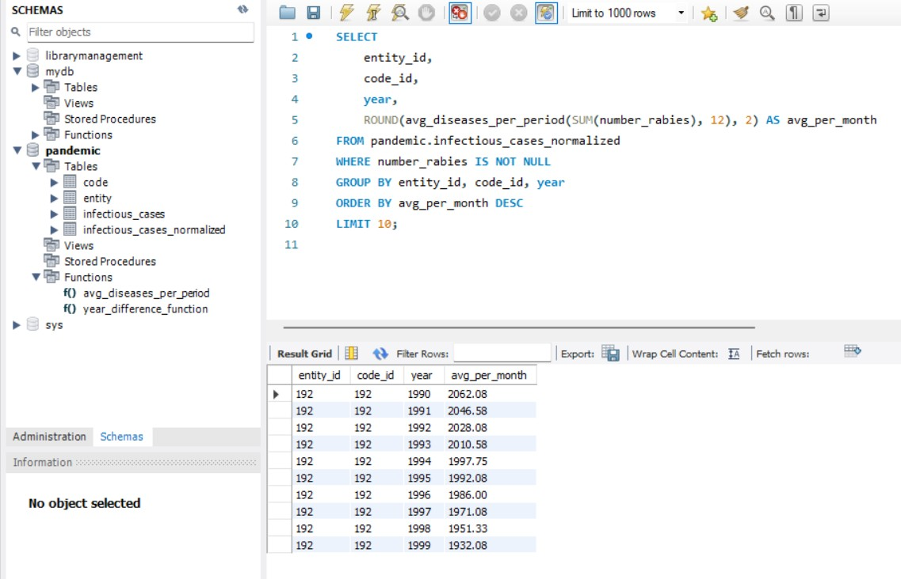

# goit-rdb-fp

1. Завантажте дані:

Створіть схему pandemic у базі даних за допомогою SQL-команди.
Оберіть її як схему за замовчуванням за допомогою SQL-команди.
Імпортуйте дані за допомогою Import wizard так, як ви вже робили це у темі 3.
Продивіться дані, щоб бути у контексті.
💡 Як бачите, атрибути Entity та Code постійно повторюються. Позбудьтеся цього за допомогою нормалізації даних.

Рішення:

2. Нормалізуйте таблицю infectious_cases до 3ї нормальної форми. Збережіть у цій же схемі дві таблиці з нормалізованими даними. Виконайте запит SELECT COUNT(\*) FROM infectious_cases , щоб ментор міг зрозуміти, скільки записів ви завантажили у базу даних із файла.

До нормалізації:

Рішення:

-- 1. Створення таблиці з унікальними Entity
CREATE TABLE entity (
entity_id INT AUTO_INCREMENT PRIMARY KEY,
entity_name VARCHAR(255) UNIQUE NOT NULL
);

-- 2. Створення таблиці з унікальними Code
CREATE TABLE code (
code_id INT AUTO_INCREMENT PRIMARY KEY,
code_name VARCHAR(255) UNIQUE NOT NULL
);

-- 3. Наповнення таблиці entity унікальними значеннями
INSERT INTO entity (entity_name)
SELECT DISTINCT Entity FROM infectious_cases
WHERE Entity IS NOT NULL AND Entity != '';

-- 4. Наповнення таблиці code унікальними значеннями
INSERT INTO code (code_name)
SELECT DISTINCT Code FROM infectious_cases
WHERE Code IS NOT NULL AND Code != '';

-- 5. Створення нової нормалізованої таблиці
CREATE TABLE infectious_cases_normalized (
id INT AUTO_INCREMENT PRIMARY KEY,
entity_id INT,
code_id INT,
year INT,
number_rabies INT,
FOREIGN KEY (entity_id) REFERENCES entity(entity_id),
FOREIGN KEY (code_id) REFERENCES code(code_id)
);

-- 6. Заповнення нормалізованої таблиці через JOIN по назвам
INSERT INTO infectious_cases_normalized (entity_id, code_id, year, number_rabies)
SELECT
e.entity_id,
c.code_id,
ic.Year,
NULLIF(ic.Number_rabies, '') + 0 -- перетворюємо '' у NULL і приводимо до INT
FROM infectious_cases ic
JOIN entity e ON ic.Entity = e.entity_name
JOIN code c ON ic.Code = c.code_name;

-- 7. Перевірка кількості записів у нормалізованій таблиці
SELECT COUNT(\*) AS normalized_count FROM infectious_cases_normalized;

Після нормалізації:

3. Проаналізуйте дані:

Для кожної унікальної комбінації Entity та Code або їх id порахуйте середнє, мінімальне, максимальне значення та суму для атрибута Number_rabies.
💡 Врахуйте, що атрибут Number_rabies може містити порожні значення ‘’ — вам попередньо необхідно їх відфільтрувати.

Результат відсортуйте за порахованим середнім значенням у порядку спадання.
Оберіть тільки 10 рядків для виведення на екран.

До аналізу:

Рішення:

SELECT
ec.entity_name,
cd.code_name,
AVG(ic.number_rabies) AS avg_rabies,
MIN(ic.number_rabies) AS min_rabies,
MAX(ic.number_rabies) AS max_rabies,
SUM(ic.number_rabies) AS sum_rabies
FROM pandemic.infectious_cases_normalized ic
JOIN pandemic.entity ec ON ic.entity_id = ec.entity_id
JOIN pandemic.code cd ON ic.code_id = cd.code_id
WHERE ic.number_rabies IS NOT NULL AND ic.number_rabies <> ''
GROUP BY ec.entity_name, cd.code_name
ORDER BY avg_rabies DESC
LIMIT 10;

Після аналізу:

4. Побудуйте колонку різниці в роках.

Для оригінальної або нормованої таблиці для колонки Year побудуйте з використанням вбудованих SQL-функцій:

атрибут, що створює дату першого січня відповідного року,
💡 Наприклад, якщо атрибут містить значення ’1996’, то значення нового атрибута має бути ‘1996-01-01’.
атрибут, що дорівнює поточній даті,
атрибут, що дорівнює різниці в роках двох вищезгаданих колонок.
💡 Перераховувати всі інші атрибути, такі як Number_malaria, не потрібно.
👉🏼 Для пошуку необхідних вбудованих функцій вам може знадобитися матеріал до теми 7.

Рішення:

SELECT
entity_id,
code_id,
year,
STR_TO_DATE(CONCAT(year, '-01-01'), '%Y-%m-%d') AS first_day_of_year,
CURDATE() AS today_date,
TIMESTAMPDIFF(YEAR, STR_TO_DATE(CONCAT(year, '-01-01'), '%Y-%m-%d'), CURDATE()) AS year_difference
FROM pandemic.infectious_cases_normalized;

5. Побудуйте власну функцію.

Створіть і використайте функцію, що будує такий же атрибут, як і в попередньому завданні: функція має приймати на вхід значення року, а повертати різницю в роках між поточною датою та датою, створеною з атрибута року (1996 рік → ‘1996-01-01’).
💡 Якщо ви не виконали попереднє завдання, то можете побудувати іншу функцію — функцію, що рахує кількість захворювань за певний період. Для цього треба поділити кількість захворювань на рік на певне число: 12 — для отримання середньої кількості захворювань на місяць, 4 — на квартал або 2 — на півріччя. Таким чином, функція буде приймати два параметри: кількість захворювань на рік та довільний дільник. Ви також маєте використати її — запустити на даних. Оскільки не всі рядки містять число захворювань, вам необхідно буде відсіяти ті, що не мають чисельного значення (≠ ‘’).

Рішення:

1. Функція розрахунку різниці в роках. Функція повертає необхідні дані:

SELECT \* FROM pandemic.infectious_cases_normalized;

DELIMITER //

CREATE FUNCTION year_difference_function(input_year INT)
RETURNS INT
DETERMINISTIC
BEGIN
DECLARE input_date DATE;
SET input_date = STR_TO_DATE(CONCAT(input_year, '-01-01'), '%Y-%m-%d');
RETURN TIMESTAMPDIFF(YEAR, input_date, CURDATE());
END //

DELIMITER ;

Приклад використання:

SELECT
entity_id,
code_id,
year,
year_difference_function(year) AS year_diff
FROM pandemic.infectious_cases_normalized
LIMIT 10;

2. Функція розрахунку кількості захворювань за певний період. Функція повертає необхідні дані:

SELECT \* FROM pandemic.infectious_cases_normalized;
DELIMITER //

CREATE FUNCTION avg_diseases_per_period(annual_cases INT, divisor INT)
RETURNS DECIMAL(10,2)
DETERMINISTIC
BEGIN
IF annual_cases IS NULL OR divisor = 0 THEN
RETURN NULL;
END IF;
RETURN annual_cases / divisor;
END //

DELIMITER ;

Приклад використання:

SELECT
entity_id,
code_id,
year,
ROUND(avg_diseases_per_period(SUM(number_rabies), 12), 2) AS avg_per_month
FROM pandemic.infectious_cases_normalized
WHERE number_rabies IS NOT NULL
GROUP BY entity_id, code_id, year
ORDER BY avg_per_month DESC
LIMIT 10;

